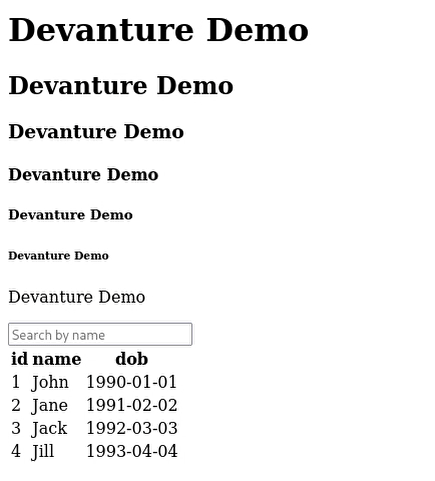

# Devanture

## Usage

```python
from devanture import components as c
from fastapi import FastAPI
from fastapi.responses import HTMLResponse

app = FastAPI()
c.set_app(app)

users = [
        {"id": 1, "name": "John", "dob": "1990-01-01"},
        {"id": 2, "name": "Jane", "dob": "1991-02-02"},
        {"id": 3, "name": "Jack", "dob": "1992-03-03"},
        {"id": 4, "name": "Jill", "dob": "1993-04-04"},
        ]

ID_USERS_TABLE = "users-table"

@app.get("/api/users/", response_class=HTMLResponse)
def search_users_get(q: str):
    return c.render(
            c.Table(
                columns=["id", "name", "dob"],
                data=[u for u in users if q.lower() in u["name"].lower()],
                id=ID_USERS_TABLE
                )
            )


@app.get("/", response_class=HTMLResponse)
def users_get():
    table = c.Table(data=users, columns=["id", "name", "dob"], id=ID_USERS_TABLE)
    return c.render(
            c.Page(
                "Devanture Demo",
                [
                    c.H1("Devanture Demo"),
                    c.H2("Devanture Demo"),
                    c.H3("Devanture Demo"),
                    c.H4("Devanture Demo"),
                    c.H5("Devanture Demo"),
                    c.H6("Devanture Demo"),
                    c.P("Devanture Demo"),
                    c.Input(
                        name="q",
                        placeholder="Search by name",
                        get=search_users_get,
                        target=table,
                        ),
                    table,
                    ]
                )
            )
```
It renders like this:


